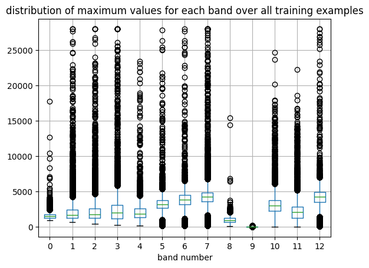
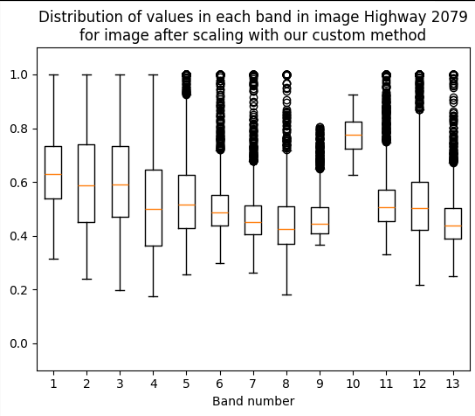

# Data preprocessing
The first main part of our project is to understand the data and the preprocessing done by the tile2vec model.

## Our dataset
The dataset provided to us is available [on kaggle](https://www.kaggle.com/datasets/apollo2506/eurosat-dataset/data). The data contains RGB and multispectral images collected by Sentinel-2 satellite within the EuroSAT project.

More about the data may be found [in the publication](https://arxiv.org/pdf/1709.00029.pdf).

| Band       | Spatial Resolution (m) | Central Wavelength (nm) |
|------------|------------------------|-------------------------|
| B01 - Aerosols | 60                   | 443                     |
| B02 - Blue  | 10                     | 490                     |
| B03 - Green | 10                     | 560                     |
| B04 - Red   | 10                     | 665                     |
| B05 - Red edge 1 | 20                | 705                     |
| B06 - Red edge 2 | 20                | 740                     |
| B07 - Red edge 3 | 20                | 783                     |
| B08 - NIR   | 10                     | 842                     |
| B08A - Red edge 4 | 20               | 865                     |
| B09 - Water vapor | 60               | 945                     |
| B10 - Cirrus | 60                     | 1375                    |
| B11 - SWIR 1 | 20                     | 1610                    |
| B12 - SWIR 2 | 20                     | 2190                    |

The data contains 27000 **labeled** images with 10 different land use and land cover cases from all over the Europe. Multispectral variant of images consists of 13 different bands. The images were collected from satellite from low-cloud level to avoid applying many cloud masks.
The proposed dataset has not received atmospheric correction. This can result in images with a color cast. 

### EuroSAT preprocessing
Before release the dataset was preprocessed. Firstly each band was resampled to 10m resoltion.  Bands with a lower spatial resolution have been upsampled to 10 meters per pixel using cubic-spline interpolation. (A practical guide to splines, volume 27. Springer-Verlag New York, 1978)

Then multiple Sentinel images were merged to create a larger image.
All of the images were manually inspected and classified. 

Ihe article proposed also a simple CNN with classification accuracy of 98.57%. The authors also compared performance of models that used only 1 band. It turned out that models that used any of RGB bands were performing better than the others. Even though band combinations outperforms the single-band images.
The non-RGB bands might be much more usefull than authors predicted, since the model they used to evaluate importance of bands was pretrained on RGB only images.

#### Side note on multispectral images
I think that the unit of the optical bands that we use is the reflectances - the ratio of reflected light by the surface. Thus this measure is simply percentage - how much light is reflected compared to the amount of light that could have been reflected.
Here is a textbook about mutlispectral data:
https://gistbok.ucgis.org/bok-topics/nature-multispectral-image-data

and some deeper dive into the sentinel bands:

https://docs.sentinel-hub.com/api/latest/data/sentinel-2-l2a/

General conclusion coming from the document above is that all the pixels we have are in the *DN* unit which is a abreviation of Digital Number and is an aproximation of reflectance. The *DN* values should be within the interval 0-4000, but, especially for infrared bands, they may exceed this value

### The scaling method

ML models usually work better in case the input variables are scaled to small values, commonly from interval [-1, 1] or [0,1]. The recommended way of scalling the data for Sentinel-2 photos is clipping the pixel values to the range (0,10000) and then to divide its values by 10000.

However, we noticed that some bands have much smaller values and this scaling may introduce very small and incomparable values. Therefore we proposed a new scaling method that clips the values in each band with 1.5 * IQR, effectively removing this bias. Unfortunately this solution hadn't improve the model performance.

We believe it may be because the outlier values may be very informative for the model, thus removing them deprives model from some significant insight into the data.

| Scaling type                                     | Random Forest | Logistic regression |
|--------------------------------------------------|---------------|---------------------|
| Default scaling                                  | 58.88±0.73%   | 58.95±0.77%         |
| Band-wise scaling with outlier detection using IQR | 51.01±0.86%  | 51.11±1.01%         |

Here is a preview of a scaled raster from the dataset using the method in tile2vec model:

There are hints suggesting that scaling bands could help our model learn.

