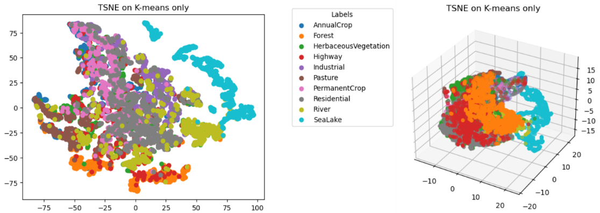
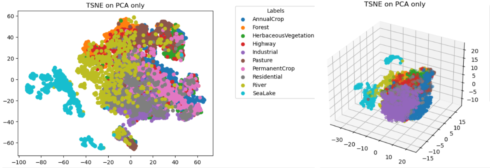
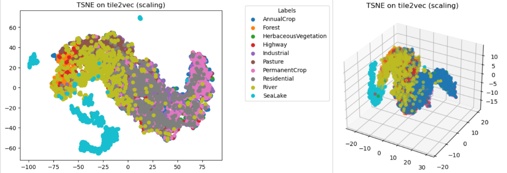

# KM1 - summary
In the given document we wil briefly describe our work done before the First Milestone.
### Goal
Our main goal was to familiarize ourselfs with the implementation of til2vec model and pretrain it on our own data.

## Training
Using our EuroSAT dataset containing over 20000 multispectral images from Sentinel-2 satellite we successfully trained the tile2vec model. We performed all of training on single Nvidia A30 GPU. 

### Model evaluation
In order to evaluate performance of unsupervised model, creating embeddings, which are not human-understandable, we trained the classifier on the produced embeddings.

Model turned out to be much worse performing than anticipated. The created embeddings were not very useful for classifiers such as logistic regression and random forest

| Embedding model   | Random Forest | Logistic regression |
|-------------------|---------------|---------------------|
| our tile2vec      | 58.88±0.73%   | 58.95±0.77%         |
| original tile2vec | 45.80±1.50%   | 45.12±1.61%         |
| PCA               | 73.33±0.78%   | 74.23±0.59%         |
| ICA               | 67.54±0.42%   | 67.49±0.62%         |
| K-means           | 75.15±0.82%   | 75.19±0.68%         |
| None              | 79.71±1.05%   | 79.72±1.42%         |

Whats interesting is that even though size of bare photos is 64x64x13, the classifier trained without any dimentionality reduction method performed best. This might be because of quite large validation dataset (over 5000 photos) that the classifier was trained on or some very simple patterns exisiting in our dataset.

#### Hyperparameters tuning
We tested only 3 hyperparameters: 
1. tile size
2. neighboring distance 
3. a scaling method

 
##### Tile size

| Tile size | Random Forest | Logistic regression |
|-----------|---------------|---------------------|
| 60        | 56.73±0.90%   | 56.43±0.97%         |
| 50        | 58.88±0.73%   | 58.95±0.77%         |
| 40        | 52.34±4.33%   | 51.60±4.23%         |
| 30        | 53.66±1.17%   | 53.44±1.09%         |

It turned out that the sampled tile size 50 is the best choice for our data. The possible reasons for that are quite small original image size and the low sampling resolution in the EuroSAT dataset.
##### Band scaling
Each multispectral image contains several channels which corresponds to different wavelenghts of light.
We had an idea that more customized pretraining could support the model in its training.
Sadly, band based scaling method turned out not to improve the model's performance.

## Output visualization

### Clustering
We created some simple visualizations of embeddings of different dimentionality reducion methods

It is visible that the clusters created by kmeans algorithm or PCA are much beter structured that the one created by assessed model.