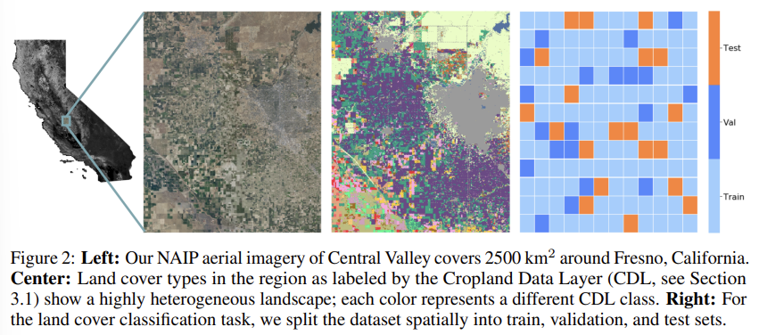
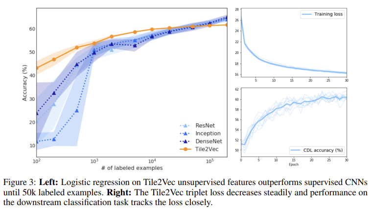

# Tile2Vec: Unsupervised representation learning for spatially distributed data

Metoda tile2vec jest analogią do metod NLP, model jest wyuczony na podstawie istotnych reprezentacji (tak jak przy NLP słowa o podobnym brzmieniu mają podobne znaczenie). Dobre do klasyfikacji.

**[link](https://arxiv.org/pdf/1805.02855.pdf) do artykułu**

## 1. intro

teledetekcja jest bardzo przyszłościowa, jest dużo danych, ale jest problem z labelami. 

Metody używane w NPL czy ImageNet (standardowy zbiór do AI dot obrazów) nie są wystarczające do teledetekcji, gdzie mamy zdjęcia z lotu ptaka i dane są multi-spectral (dane są zbierane w różnych pasmach spektralnych, żeby np analizować cechy terenu).

W tile2vec głównym założeniem jest to że fragmenty obrazów geograficznie sąsiednich są podobne do siebie. Tile2Vec operuje na unlabeled danych teledetekcyjnych (remote sensing), ale ten model też może być wykorzystany do innych danych

## 2. Tile2Vec

### 2.1 Distributional semantics

analiza uwzględniająca co z czym często występuje

w tile2vec to ma być takie rozwinięcie metod z modeli działających na słowach, jak word2vec czy GloVe

problemem jest to jak małe próbki tworzyć i to że są to dane high-dimensional, wykorzystany będzie CNN (convolutional neural network) żeby zrobić reprezentacje o niskiej wymiarowości

jest to model unsupervised

ważne założenie: krajobraz jest silnie przestrzennie skorelowany

### 2.2 Unsupervised triplet loss

żeby wyuczyć CNN trenujemy sieć na trójkach płytek (triplets of tiles), jedna jest taka podstawowa (anchor), druga sąsiadująca (neighbor) a trzecia odległa (distant). 

Plan jest taki, żeby płytka podstawowa i sąsiadująca były jak najbardziej podobne (najmniejsza odległość euklidesowa, jakaś tam metryka) i żeby płytka podstawowa i odległa były jak najbardziej różne (z jakimś ograniczeniem odległości ofc)

Generalnie bierzemy takie trójeczki tak, żeby “triplet loss” było jak najmniejsze

+jakieś wzorki matematyczne

### 2.3 Triplet sampling

trójki wybieramy na podstawie dwóch parametrów: rozmiar płytki i rozmiar obszaru z którego jest brana sąsiednia płytka

nie jest potrzebna wiedza o rzeczywistej lokalizacji geograficznej

### 2.4 Scalability

model można trenować na podstawie małych próbek, co jest korzystne dla dużych datasetów (???)

dzięki temu jaka jest funkcja “triplet loss”, można zmieniać te trójki, liczba przykładów treningowych się zwiększa z O(N) do O(N^2) - data augmentation

dzięki temu algorytm jest łatwy do wytrenowania i odporny na hiperparametry i overfitting

## 3. Datasets

opis danych na których model był wytrenowane - chyba to nie jest super istotne na ten moment

## 4. Experiments

głównie chodzi o to że optymalny wybór hiperparametrów (rozmiar płytek i sąsiedztwo) wpływa na wydajność. Dla różnych zbiorów danych trzeba dobrać odpowiedni balans.

porównanie Tile2Vec z innymi supervised modelami

+więcej szczegółów dotyczących różnego rodzaju testowania modelu na różnego rodzaju datasetach, dużo przykładów

## conclusion

- unsupervised
- feature learning - sam się uczy reprezentacji danych które nie mają etykiet
- do danych rozproszonych przestrzennie
- do różnorodnych zbiorów danych (był testowany w kontekście klasyfikacji pokrycia terenu ale też np prognozowania ubóstwa)
- działa dla RGB, ale też dla multi-spectral
- odpowiedni do zdjęć lotniczych i satelitarnych, ale też ok do nieobrazowych danych
- przewyższa inne techniki ekstrakcji danych unsupervised przy trudnej klasyfikacji, a nawet w niektórych przypadkach przewyższa różne supervised CNN